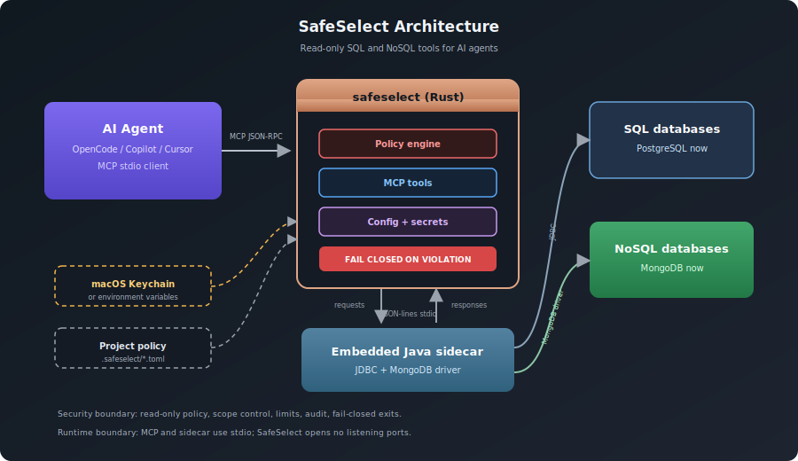

# SafeSelect

**MCP SQL Fail-Closed for AI Agents**

[](https://github.com/antonillos/safeselect/actions/workflows/verify.yml)
[]()
[]()
[]()
[]()
[](https://github.com/antonillos/homebrew-tap)
[](https://github.com/antonillos/asdf-safeselect)
[](LICENSE)

SafeSelect is a secure SQL proxy between AI coding agents and your databases. It implements the **Model Context Protocol (MCP)** with a fail-closed security model — any incident terminates the process.

---

## Architecture

<p align="center">
  
</p>

- All communication between Rust and Java is JSON-lines over stdin/stdout — no network, no sockets, no open ports
- The Java sidecar is embedded in the Rust binary and extracted at runtime

---

## Quick Start

```bash
# 1. Install
brew install antonillos/tap/safeselect

# 2. Download a JDBC driver
safeselect driver download --vendor postgresql

# 3. Import from DBeaver — creates .safeselect/ with connection configs
#    and stores passwords in macOS Keychain automatically.
safeselect import-dbeaver ~/Downloads/dbeaver-export.zip

#    Or import from docker-compose:
#    safeselect import-compose

#    Or configure manually (see Configuration below)
#    and set a password:
#    safeselect config set-password --environment testing

# 4. Test connectivity (auto-detects .safeselect/ from repo root)
safeselect check --environment testing

# 5. Install in OpenCode (entry name defaults to <project>-testing)
safeselect agent install opencode --environment testing
```

---

## Security Model

- **Fail-closed**: any security violation kills the MCP process immediately
- **Read-only**: only `SELECT`, `EXPLAIN`, and `WITH` queries allowed
- **Single statement**: multi-statement SQL rejected
- **Schema control**: allow/deny specific schemas and relations
- **SHA-256 drivers**: JDBC JAR checksummed on every use
- **macOS Keychain**: secrets never stored in config files
- **Password isolation**: passed via stdin, never as CLI args
- **Result limits**: row count and byte size enforced

---

## CLI Reference

| Command | Description |
|---|---|
| `serve --project <p> --environment <e>` | Start the MCP server |
| `query --project <p> --environment <e> --sql <q>` | Execute SQL directly |
| `check --project <p> --environment <e>` | Test connectivity |
| `config validate [--project <p>] [--environment <e>]` | Validate config |
| `config show --project <p> --environment <e>` | Show resolved config |
| `config rename-environment --old <o> --new <n>` | Rename environment |
| `config delete-environment --name <n>` | Delete environment |
| `config set-password --environment <e>` | Store password in Keychain and update config |
| `driver download --vendor postgresql` | Download JDBC driver |
| `driver add --vendor <v> --path <jar> --class <c>` | Register custom driver |
| `driver list` | List registered drivers |
| `agent install <client> --environment <e> [--project <p>] [--name <n>]` | Install MCP entry (name defaults to `<project>-<environment>`) |
| `agent uninstall <client> --name <n>` | Remove MCP entry |
| `agent detect` | Detect installed MCP clients |
| `agent status` | Show installation status |
| `import-dbeaver <path-to-zip>` | Import from DBeaver export |
| `import-compose [--path <yml>] [--non-interactive]` | Import from docker-compose |
| `connect --project <p> --environment <e>` | Reconnect to database |
| `disconnect --project <p> --environment <e>` | Disconnect from database |
| `uninstall` | Remove SafeSelect entirely |

---

## MCP Tools

| Tool | Description | Arguments |
|---|---|---|
| `select` | Execute a SELECT query | `sql` (required) |
| `list_tables` | List database tables | `schema` (optional) |
| `explain` | Show execution plan | `sql` (required, not executed) |
| `connect` | Reconnect to the database after connection loss | _(none)_ |
| `disconnect` | Close the database connection | _(none)_ |
| `import_compose` | Scan docker-compose files and import PostgreSQL services | `scan_path` (optional) |
| `delete_environment` | Delete an environment configuration | `name` (required) |
| `rename_environment` | Rename an environment (migrates secret reference) | `old_name` (required), `new_name` (required) |

---

## Configuration

Global config lives in `$SAFESELECT_CONFIG_DIR` (default: `~/.config/safeselect/`),
shared across all projects (drivers, sidecar).

```
~/.config/safeselect/
├── drivers/
│   └── postgresql.toml           # registered JDBC drivers
└── sidecar/
    └── safeselect-sidecar.jar    # embedded Java sidecar
```

Each project (git repo) carries its own `.safeselect/` directory:

```
<repo-root>/
└── .safeselect/
    ├── project.toml              # security policy + limits
    └── environments/
        └── <env>.toml            # connection + secrets
```

Commands auto-detect `.safeselect/` by walking up from the current directory.
Use `--project <path>` to point to a specific repo root.

**project.toml** sets the maximum policy that no environment can relax:

```toml
version = 1
[security]
allowed_schemas = ["public"]
denied_relations = ["public.users_credentials"]
[limits]
statement_timeout_ms = 5000
max_rows = 500
max_result_bytes = 2_000_000
```

**environments/testing.toml** sets connection details:

```toml
version = 1
[database]
driver = "postgresql"
url = "jdbc:postgresql://localhost:5432/myapp"
username = "reader"
```

The password is configured separately — run this once:

```bash
safeselect config set-password --environment testing
```

This stores the password in your macOS Keychain and adds the `[database.secret]` section to the toml automatically.

### Advanced: Manual secret setup

If you prefer to configure secrets by hand, add this to the environment toml:

```toml
[database.secret]
source = "macos-keychain"
service = "safeselect"
account = "myapp/testing"
```

Then store the password in the Keychain:

```bash
security add-generic-password -a "myapp/testing" -s "safeselect" -w "<password>"
```

For non-macOS systems, use an environment variable instead:

```toml
[database.secret]
source = "env"
variable = "SAFESELECT_PASSWORD_TESTING"
```

Then export the variable before running `safeselect`.
---

## Detected AI Agents

- OpenCode (install supported)
- GitHub Copilot, Cursor, Windsurf, Claude Code, Codex, Gemini CLI (detected only)

---

## Requirements

- Rust 1.81+ (to build from source)
- Java 17+
- Maven 3.8+ (to rebuild the sidecar)

---

## Documentation

- [Installation guide](docs/install.md)
- [AI agent integration](docs/agents.md)
- [Security model](docs/security.md)
- [Distribution](docs/distribution.md)

---

## License

MIT – see [LICENSE](LICENSE).
