<h1 align="center">
  <picture>
    <source media="(prefers-color-scheme: dark)" srcset="site/public/icon-dark.svg">
    
  </picture>
  SafeSelect
</h1>

<h6 align="center">Agents can look. They cannot mutate.</h6>

<h3 align="center">Read-only PostgreSQL &amp; MongoDB access for coding agents.</h3>

<p align="center">
  Debug with real database context, without exposing write tools.<br>
  Local, project-scoped policy—even when your existing credentials allow writes.
</p>

<p align="center">
  <a href="#quick-start"><strong>Get started →</strong></a> ·
  <a href="#see-it-in-action">Demo</a> ·
  <a href="#supported-agents">Agents</a> ·
  <a href="docs/security-proof.md">Security</a> ·
  <a href="#documentation">Docs</a> ·
  <a href="https://antonillos.github.io/safeselect/">Website</a>
</p>

<p align="center">
  <a href="https://github.com/antonillos/safeselect/actions/workflows/verify.yml"></a>
  <a href="https://github.com/antonillos/safeselect/actions/workflows/verify.yml"></a>
  <a href="LICENSE"></a>
</p>

## What you can do

- **Inspect PostgreSQL** — discover tables, indexes and query plans; read bounded rows.
- **Explore MongoDB** — discover collections, infer sampled schemas and run bounded reads.
- **Reuse your connections** — import from DBeaver, Docker Compose or MongoDB Compass.
- **Connect your coding agent** — install a project/environment-pinned MCP entry.
- **Keep control** — local stdio, project policy, external secrets and audit metadata.

> [!IMPORTANT]
> Read-only applies to SafeSelect's database tools, not to an agent's shell,
> other MCP servers or direct credentials. Start with development data or a
> sanitized replica and use least-privilege database users. Review the
> [threat model and limits](docs/security-proof.md) before connecting sensitive data.

## See it in action

### Complete onboarding: from Homebrew to a protected agent

<p align="center">
  
</p>

Install SafeSelect from Homebrew, import an SSH-backed DBeaver connection,
keep the password in macOS Keychain, install the OpenCode integration, and see
the agent read a paid order while its `DELETE` attempt is rejected. Focused
agent and backend clips remain in the [complete demo gallery](demo/README.md).

## Quick Start

Run setup from your repository root. You will need a PostgreSQL or MongoDB
connection and a **Java 17+ runtime** for database commands.

### 1. Install

<a id="homebrew-macos"></a>

On macOS with Homebrew:

```bash
brew install antonillos/tap/safeselect
```

<details>
<summary>Other installation methods: prebuilt binaries and asdf</summary>

### Prebuilt binaries (macOS & glibc Linux)

Download a platform-specific, prebuilt binary for macOS or glibc-based Linux
from the [latest GitHub release](https://github.com/antonillos/safeselect/releases/latest).
The verified installer selects the matching macOS or glibc Linux architecture,
checks the published SHA-256 digest, and installs to `~/.local/bin`:

```bash
curl -fsSL https://raw.githubusercontent.com/antonillos/safeselect/main/packaging/install/install-release.sh | sh
```

Set `PREFIX` to choose another installation directory. SafeSelect still needs
a Java 17+ runtime at execution time.

### asdf (macOS & Linux)

```bash
asdf plugin add safeselect https://github.com/antonillos/asdf-safeselect.git
asdf install safeselect latest
SAFESELECT_VERSION="$(asdf latest safeselect | sed -n '$p')"
asdf set -u safeselect "${SAFESELECT_VERSION}"
asdf reshim safeselect "${SAFESELECT_VERSION}"
```

</details>

SafeSelect uses any available Java 17+ runtime rather than requiring a specific
package-manager formula. If Java is missing or too old, install or select a
Java 17+ runtime before running database commands. On macOS with Homebrew, you
can install one with `brew install openjdk@17`.

### 2. Import one connection source

Choose the source you already use; you do not need to run all three:

| Connection source | Command |
|---|---|
| DBeaver export | `safeselect import-dbeaver ~/Downloads/dbeaver-export.zip` |
| PostgreSQL in Docker Compose | `safeselect import-compose` |
| MongoDB Compass | `safeselect import-compass --path "$HOME/.config/MongoDB Compass"` |

Use your actual export or Compass directory. Follow the importer's next steps
for driver and password setup before continuing. Keep secrets out of project
files. For an SSH-backed walkthrough, see [DBeaver → Codex](docs/guides/dbeaver-codex.md).

### 3. Check and connect your agent

```bash
# Check configured environments; this can open SSH tunnels and contact databases.
safeselect check

# Install for OpenCode (replace with codex for OpenAI Codex).
safeselect agent install opencode

# Inspect the installed MCP entry and its configuration location.
safeselect agent status
```

**Multiple environments?** Use `safeselect check --environment <name>` to avoid
checking unrelated databases, and add `--environment <name>` to
`agent install` to select the intended target. Installation infers the name only
when there is one environment.

Open or restart your agent and approve the MCP server if prompted. Installation
uses user scope by default; see [supported agents](#supported-agents) and the
[client setup guide](docs/agents.md) for project scope and client-specific steps.

### 4. Try a first read

Ask your agent:

> Use SafeSelect to identify the connected backend and discover its available
> tables or collections. Describe one, then stop before querying row or document
> contents. Follow next suggestions only within that discovery-only scope.

**Success looks like:** the agent calls `database_info`, uses the matching
schema-discovery tools, and reports the structure it found. No write tools or
database passwords are needed in the conversation.

**Stuck?** Run `safeselect doctor --environment <name>` for concise diagnostics
(this can contact the database), then follow the reported next step. Do not
relax policy to get past a rejection. See [agent recovery](docs/agents.md#agent-recovery-flow).

<details>
<summary>What gets installed? MCP configuration and scope</summary>

The generated MCP name defaults to `safeselect-<project>-<environment>`.

The generated MCP entry is a stdio server scoped to one project and environment:

```json
{
  "mcpServers": {
    "safeselect-myapp-testing": {
      "command": "safeselect",
      "args": ["serve", "--project", "/path/to/myapp", "--environment", "testing"]
    }
  }
}
```

SafeSelect uses each client's official MCP configuration contract, pins the
absolute repository path, and defaults to user scope. Add `--local` for a
project-scoped entry where the client supports it. See
[AI agent integration](docs/agents.md) for exact paths, scopes, and manual
configuration.

</details>

## Documentation

| I want to… | Start here |
|---|---|
| Choose a client or configure MCP manually | [AI agent integration](docs/agents.md) |
| Import an SSH-backed DBeaver connection | [DBeaver → Codex walkthrough](docs/guides/dbeaver-codex.md) |
| Watch other clients and backends | [Demo gallery](demo/README.md) |
| Understand the boundary and its limits | [Security proof and threat model](docs/security-proof.md) |
| Compare database MCP approaches | [Comparison](docs/compare.md) |
| Find a command or tool | [CLI essentials](#cli-essentials) · [Visual command gallery](#visual-command-gallery) · [MCP tools](#mcp-tools) |
| Build or contribute | [Contributing](CONTRIBUTING.md) |

## Where It Helps

- Debug an application against realistic data without exposing mutation tools.
- Let an agent inspect schemas, indexes, query plans, and bounded rows during development.
- Explore MongoDB collections through bounded reads and sampled schema inference.
- Reuse existing DBeaver, Docker Compose, or MongoDB Compass connections.
- Give coding agents database context while keeping policy, limits, secrets, and audit under your control.

## Why SafeSelect?

SafeSelect is intentionally narrower than general-purpose database MCP servers. It is not a tool builder, SQL workbench, or remote database gateway. It is a local safety boundary for agents that need database visibility, not database power.

| SafeSelect prioritizes | What this means |
|---|---|
| Local stdio transport | No network listener or open MCP port |
| Read-only tools | Agents do not receive write-capable database tools |
| Credential-independent safety | Even DBA credentials are constrained to SafeSelect's read-only tool surface |
| Fail-closed enforcement | Policy violations terminate the process |
| Secret isolation | Passwords stay in Keychain or environment variables |
| Project-scoped policy | Each repository defines its own allowed data surface |
| Embedded sidecar | One installed binary reaches JDBC and MongoDB drivers behind Rust policy |

## What Makes It Different?

The combination matters: PostgreSQL **and** MongoDB inspection, a fixed database
read surface, local stdio, project policy, connection import and reproducible
security evidence. Read-only modes and layered controls also exist in other
projects; they are not exclusive to SafeSelect.

See the [dated comparison](docs/compare.md) for DBHub, MongoDB MCP Server,
Postgres MCP Pro and SchemaBrain—including when each is a better fit.

**Agents can look, but they cannot mutate through SafeSelect's database tools.**
This boundary does not cover a shell, another MCP server or direct credentials
also available to the agent. Use least-privilege database users and review the
[threat model and limits](docs/security-proof.md).

## Backend Support

| Backend | Status | Tools |
|---|---|---|
| PostgreSQL | Supported | Discovery, indexes/statistics, `select`, and `explain` |
| MongoDB | Supported | Discovery, find, aggregation, distinct/count, explain, profiling, schema inference, and anonymized fixtures |

## Architecture

<p align="center">
  
</p>

The agent talks to SafeSelect through MCP stdio. SafeSelect enforces policy in Rust, stores secrets outside project files, and reaches databases through an embedded Java sidecar: JDBC for SQL backends and the MongoDB driver for MongoDB. The Rust to Java channel is JSON-lines over stdin/stdout: no sockets, no open ports.

## Guided MCP Context

Clients that support MCP prompts can invoke `read_only_database_debugging` for a
safe investigation checklist. Clients can also read
`safeselect://guide/read-only-database-debugging` for the same static workflow
and boundary notes. Neither capability exposes database data, credentials, or
write access; use the database tools below for discovery and bounded reads.

## Agent Workflow

Agents should use SafeSelect in this order:

1. `database_info`
2. `list_tables` then `describe_table`; inspect `list_table_indexes` or bounded statistics when useful for SQL
3. `list_databases`, `list_collections`, then `discover_document_schema` for NoSQL
4. `select` / `explain`, or the bounded MongoDB read tool that matches the task
5. `check`, `connect`, or `reconnect` when connectivity is stale

Agents must discover relation or collection structure before querying unfamiliar data and use each discovery response's `next_suggestion` instead of guessing column or field names. SQL descriptions are catalog metadata; MongoDB schemas are inferred from a bounded, non-exhaustive sample.

MongoDB query documents must remain complete nested JSON values. Clients that
flatten nested tool arguments can pass `filter`, `projection`, and `sort` as
JSON-encoded object strings and `pipeline` as a JSON-encoded array string.
`redact_fields` also accepts a JSON-encoded string array. Flattened keys are
rejected so a lost filter or redaction can never become a less constrained
fallback.

MongoDB server-side JavaScript is never available: `$where`, `$function`, and
`$accumulator` are rejected recursively in filters, projections, sorts, and
aggregation pipelines before the MongoDB driver receives them. When rejected,
rebuild the request with declarative MQL operators; SafeSelect has no setting
that enables JavaScript.

Query responses include `row_count`, `byte_count`, `elapsed_ms`, and a human-readable `elapsed` value so agents can reason about result size and latency.

Every MCP success and error includes one contextual `next_suggestion`. Agents
should follow that single safe action, never blindly repeat an invalid request,
and stop when the suggestion is terminal. For clients that only show an MCP
error summary, SafeSelect also includes the trusted next suggestion in that
summary without exposing database-derived detail.

## Security Model

- **Fail closed**: security violations terminate the MCP process.
- **Read only**: SQL allows `SELECT`, `EXPLAIN`, and `WITH`; NoSQL backends allow discovery and read-only document reads.
- **No server-side JavaScript**: MongoDB `$where`, `$function`, and `$accumulator` are rejected in Rust and again in the Java sidecar.
- **Scoped access**: schemas, relations, databases, and collections can be allowed or denied.
- **Hard limits**: row count, result bytes, and timeouts are enforced; MongoDB read commands receive the same timeout as `maxTimeMS`.
- **Secret isolation**: passwords live in macOS Keychain or environment variables, never in project config.
- **Driver verification**: JDBC drivers are checked by SHA-256 before use.
- **Audit trail**: query text is hashed before being recorded; the current session exposes bounded audit metadata through `audit_status` and `audit_recent`.

### Deliberate Limits

- SafeSelect does not expose database writes, migrations, administration, or arbitrary command execution.
- PostgreSQL and MongoDB are the supported backends today; broad connector count is not the goal.
- MCP transport is local stdio. SafeSelect is not a remote database gateway.
- MongoDB schema discovery is sampled and bounded, not an exhaustive schema guarantee.
- SafeSelect complements database-native least privilege; it does not replace it.

## MCP Tools

| Area | Tools |
|---|---|
| SQL | `list_tables`, `describe_table`, `list_table_indexes`, `list_table_partitions`, `get_database_stats`, `get_table_stats`, `get_maintenance_diagnostics`, `select`, `explain` |
| MongoDB reads | `list_databases`, `list_collections`, `find_documents`, `aggregate_documents`, `distinct_documents`, `count_documents`, `explain_documents` |
| MongoDB analysis | `profile_document_field`, `discover_document_schema`, `generate_document_fixture`, `list_collection_indexes`, `get_database_stats`, `get_collection_stats` |
| Connection | `database_info`, `check`, `connect`, `disconnect`, `reconnect` |
| Audit | `audit_status`, `audit_recent` |
| Config | `config_validate`, `config_show`, `config_set_password`, `config_rename_environment`, `config_delete_environment`, `config_reset` |
| Setup | `import_compose`, `driver_list`, `driver_add`, `driver_download`, `agent_detect`, `agent_install`, `agent_status`, `agent_uninstall` |

`get_maintenance_diagnostics` supports PostgreSQL 15, 16, 17, and 18.

When no `.safeselect/` directory exists, `safeselect serve` scans for PostgreSQL
Compose services. If found, it enters setup mode automatically: it imports them,
writes project configuration, and starts a setup-only MCP server. Otherwise it
prints setup instructions and exits.
An existing but empty or invalid configuration is rejected, not replaced by setup.

> [!IMPORTANT]
> Setup mode does not expose query tools. Agents can help import and validate configuration before any database inspection tools become available.

## CLI Essentials

| Command | Purpose |
|---|---|
| `safeselect serve [--environment <env>]` | Start the MCP server |
| `safeselect check [--environment <env>]` | Verify config, secrets, tunnels, sidecar, and backend connectivity for all environments by default |
| `safeselect doctor [--environment <env>]` | Print concise findings with stable codes for every environment by default |
| `safeselect posture [--environment <env>]` | Inspect PostgreSQL posture for every environment by default |
| `safeselect import-dbeaver <zip>` | Import DBeaver connections |
| `safeselect import-compose [--path <path>]` | Import from docker-compose |
| `safeselect import-compass [--path <path>]` | Import MongoDB Compass connections |
| `safeselect agent install <client> [--environment <env>]` | Install an MCP entry |
| `safeselect config set-password [--environment <env>]` | Store the database password |
| `safeselect config set-ssh-password [--environment <env>]` | Store the SSH password |
| `safeselect uninstall` | Remove installed binaries, global state, audit data, and Keychain entries |
| `safeselect uninstall --binary-only` | Remove only user-local binaries and preserve configuration |

### Visual command gallery

The CLI is easier to scan by task than as one long list. The [web command gallery](https://antonillos.github.io/safeselect/commands/) uses the same synthetic-demo captures. `query` is kept separate because it is a direct SQL workflow; agents should normally discover schema first through MCP tools.

<details>
<summary><strong>Import connections</strong> — Bring an existing DBeaver, Docker Compose or MongoDB Compass connection into the project.</summary>


#### `import-dbeaver`

Import a DBeaver export into .safeselect/.

```bash
safeselect import-dbeaver ~/Downloads/connections.zip
```

<p>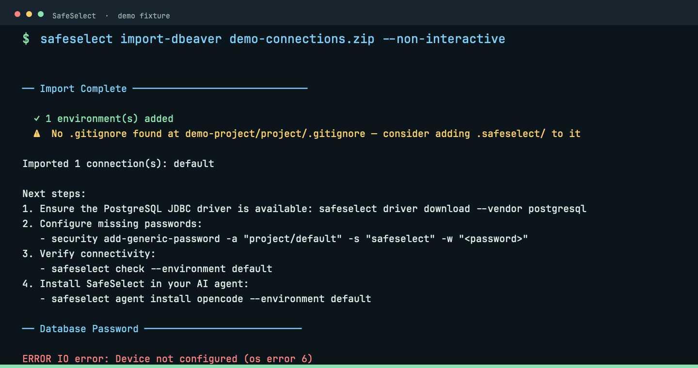</p>

_The importer keeps the connection shape while leaving passwords outside project files._


#### `import-compose`

Discover PostgreSQL services from Docker Compose.

```bash
safeselect import-compose --path .
```

<p>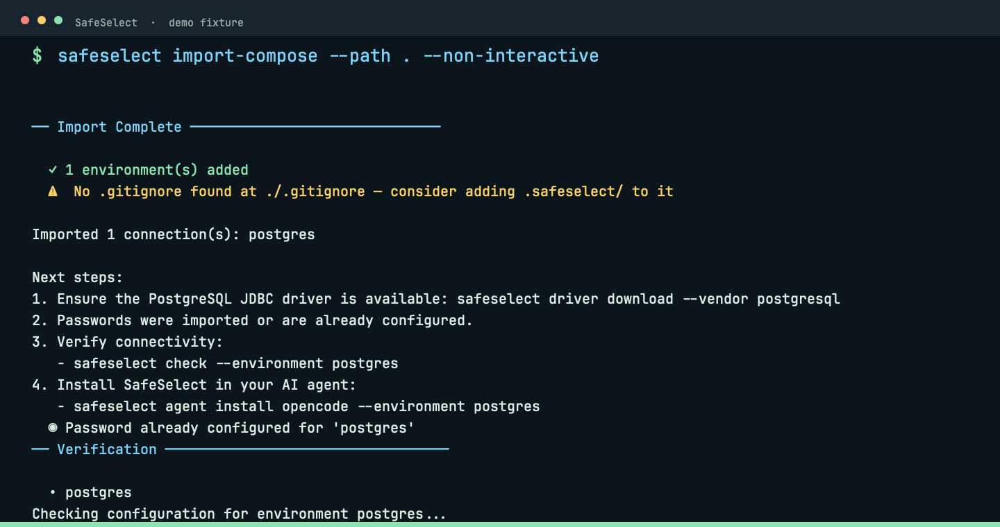</p>

_Compose discovery turns an existing local service into a project environment._


#### `import-compass`

Import MongoDB Compass connections.

```bash
safeselect import-compass --path ~/.config/MongoDB Compass
```

<p>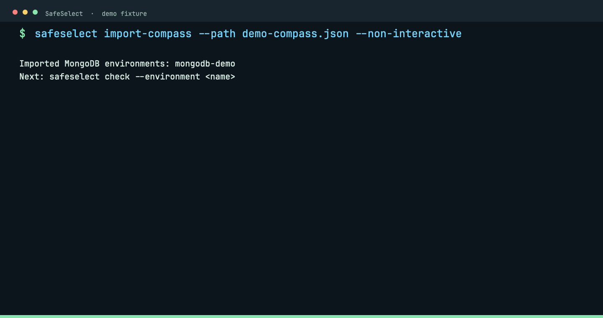</p>

_Compass imports preserve MongoDB connection details without exposing credentials._


</details>

<details>
<summary><strong>Prepare the project</strong> — Validate local policy, install drivers and connect an AI client without repeating configuration flags.</summary>


#### `config`

Validate, inspect and maintain project configuration.

```bash
safeselect config show --project demo --environment postgres
```

<p>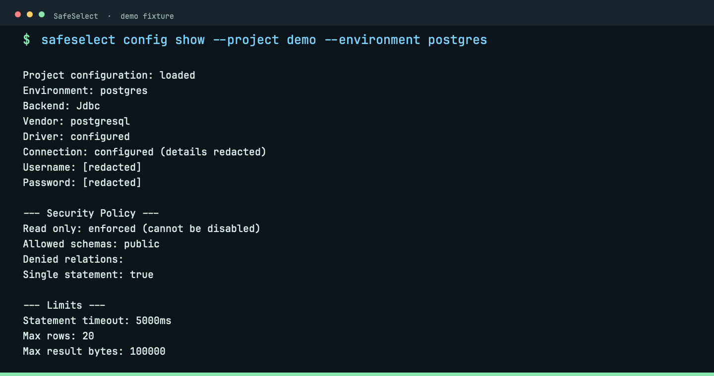</p>

_Configuration show reports a safe, redacted policy summary before the server starts._


#### `driver`

Register and verify JDBC drivers.

```bash
safeselect driver list
```

<p>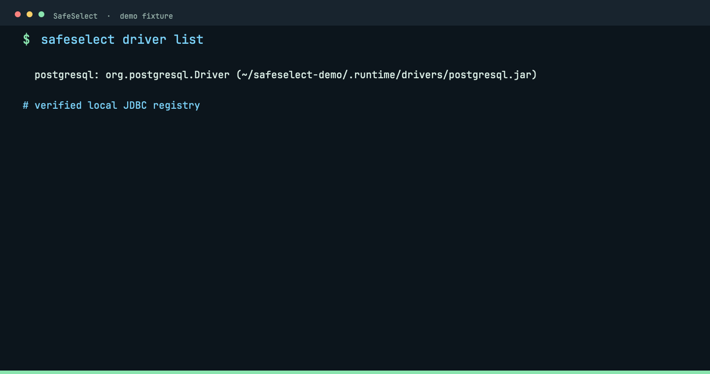</p>

_The driver registry shows the vendor and local verified artifact._


#### `agent`

Detect clients and install their MCP entry.

```bash
safeselect agent detect
```

<p>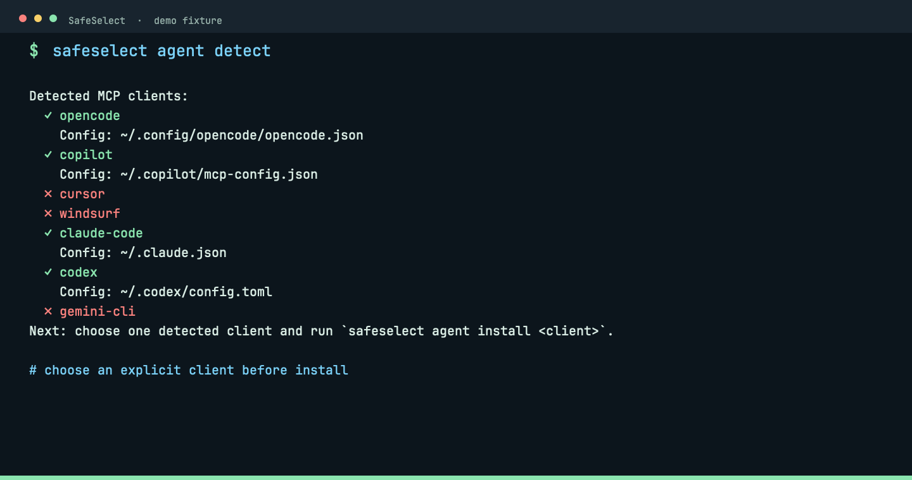</p>

_Detection lists available clients before an explicit project-scoped MCP install._


</details>

<details>
<summary><strong>Verify and diagnose</strong> — Check the complete path from project policy to the database, then inspect the effective PostgreSQL posture.</summary>


#### `check`

Test configuration, secrets, tunnels, sidecar and backend connectivity.

```bash
safeselect check
```

<p>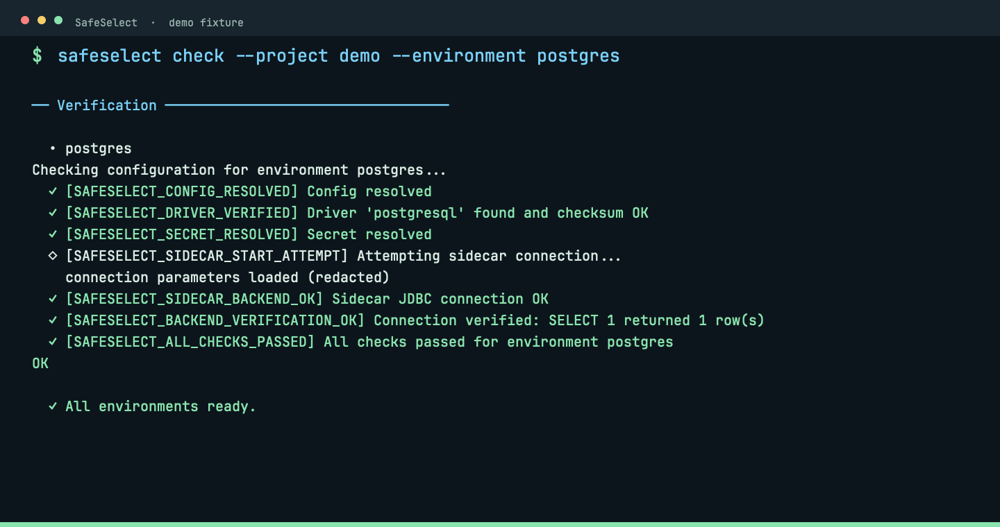</p>

_Checks follow convention and inspect every environment unless one is selected deliberately._


#### `doctor`

Print concise findings with stable diagnostic codes.

```bash
safeselect doctor
```

<p>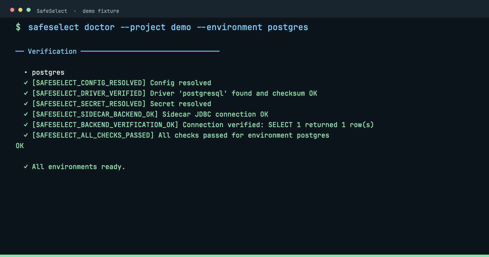</p>

_Doctor turns a failed connection into a short next action instead of a log wall._


#### `posture`

Inspect the effective PostgreSQL security posture.

```bash
safeselect posture --strict
```

<p>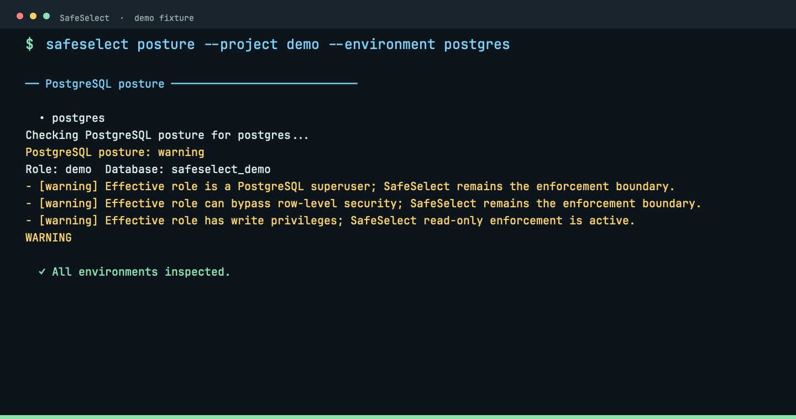</p>

_Posture shows the effective read-only policy, limits and database posture before agent use._


</details>

<details>
<summary><strong>Manage a connection</strong> — Start the local MCP server or exercise the temporary connection lifecycle directly.</summary>


#### `serve`

Start the local MCP server for a project environment.

```bash
safeselect serve
```

<p>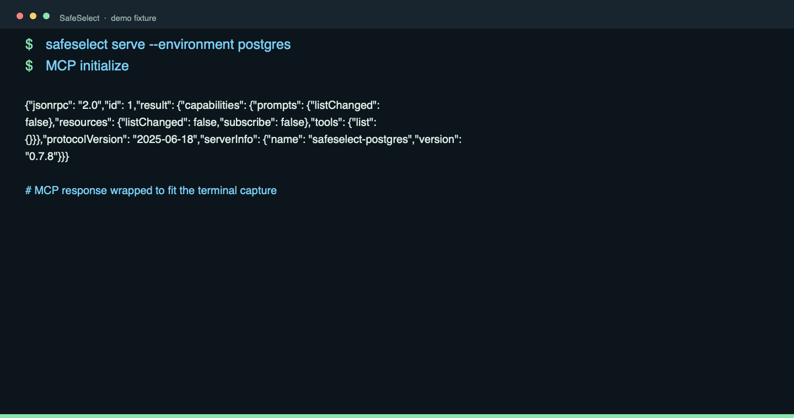</p>

_The server speaks local stdio: the MCP initialize response exposes SafeSelect capabilities, not a network listener._


#### `connect`

Test a temporary JDBC connection.

```bash
safeselect connect
```

<p>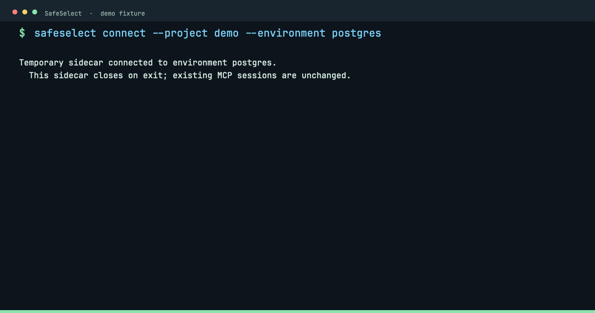</p>

_Connect verifies the temporary JDBC sidecar against the live fixture without taking over an active MCP session._


#### `disconnect`

Close a temporary JDBC connection.

```bash
safeselect disconnect
```

<p>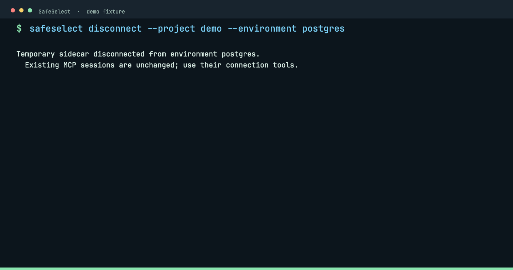</p>

_Disconnect cleanly closes the temporary JDBC sidecar and reports the completed lifecycle step._


#### `reconnect`

Restart the sidecar and verify connectivity.

```bash
safeselect reconnect
```

<p>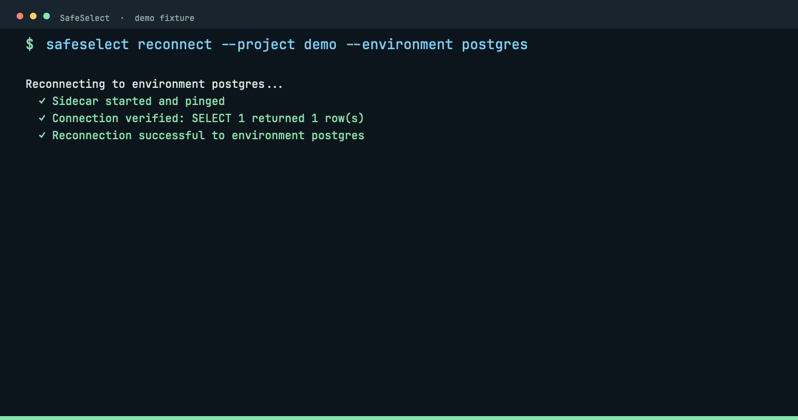</p>

_Reconnect restarts the sidecar and verifies the live fixture instead of hiding a stale database._


</details>


<details>
<summary><strong>Explore SQL: discover, inspect and diagnose</strong> — Use query when you already know the bounded SQL you want to inspect. Agents should normally discover schema first through MCP tools.</summary>


#### `query`

Execute one bounded read-only SQL statement and display its results.

```bash
safeselect query --sql "SELECT order_id, status, subtotal FROM public.demo_orders WHERE status = 'paid' LIMIT 3"
```

<p>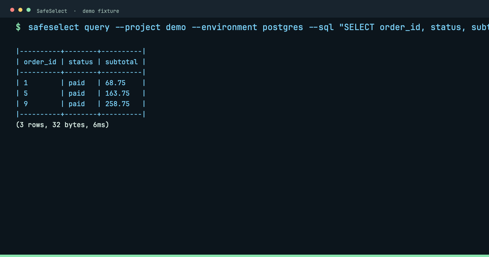</p>

_The bounded SQL request returns three synthetic fixture rows with row and byte counts; writes remain rejected._


#### `list_tables` (MCP)

Discover PostgreSQL tables through MCP.

```text
list_tables({"schema":"public"})
```

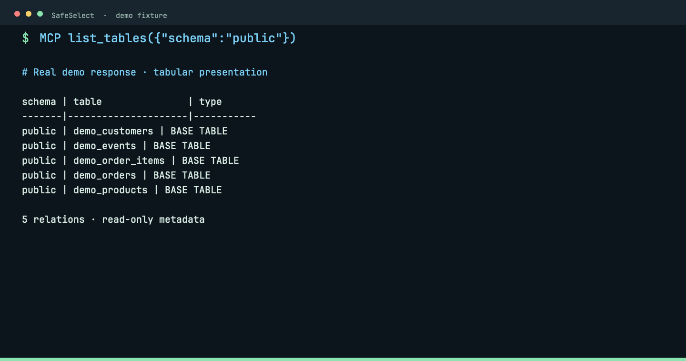

Real MCP response, formatted as a table: five synthetic relations in public. Discover exact names before inspecting columns.

#### `describe_table` (MCP)

Inspect column names, types and nullability through MCP.

```text
describe_table({"schema":"public","table":"demo_orders"})
```

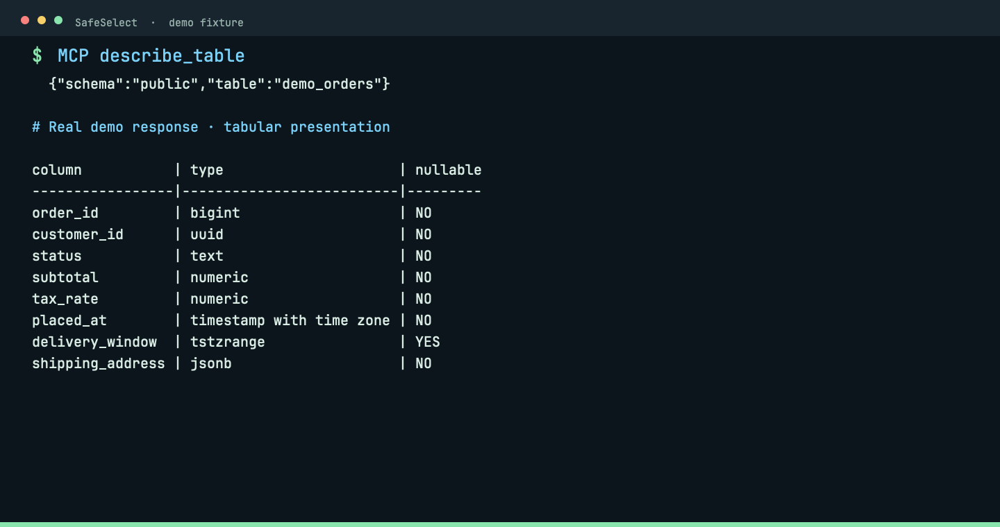

Real MCP response, formatted as a table: eight columns including UUID, JSONB and a timestamp range. No data rows are queried.

#### `get_maintenance_diagnostics` (MCP)

Inspect ANALYZE and VACUUM signals without running maintenance.

```text
get_maintenance_diagnostics({"schema":"public"})
```

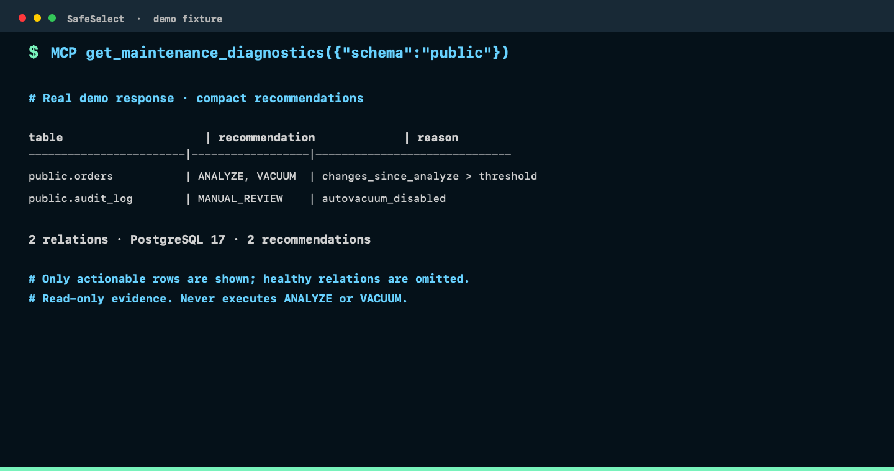

Real MCP response excerpt: all five fixture tables are below maintenance thresholds. This read-only diagnostic never executes ANALYZE or VACUUM; review the evidence with a DBA.

</details>

<details>
<summary><strong>Explore NoSQL: discover, infer and read</strong> — Follow MongoDB discovery from databases to bounded documents, with sampled schema inference before reads.</summary>

#### `list_databases` (MCP)

Discover MongoDB databases through MCP.

```text
list_databases()
```

<p>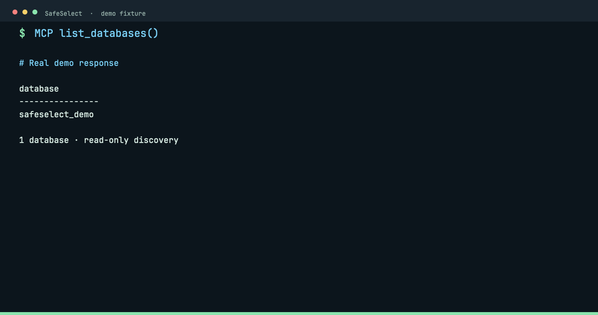</p>

_Real MCP response: the isolated demo exposes one allowed database. Choose it before discovering collections._

#### `list_collections` (MCP)

Discover collections in an allowed MongoDB database.

```text
list_collections({"database":"safeselect_demo"})
```

<p>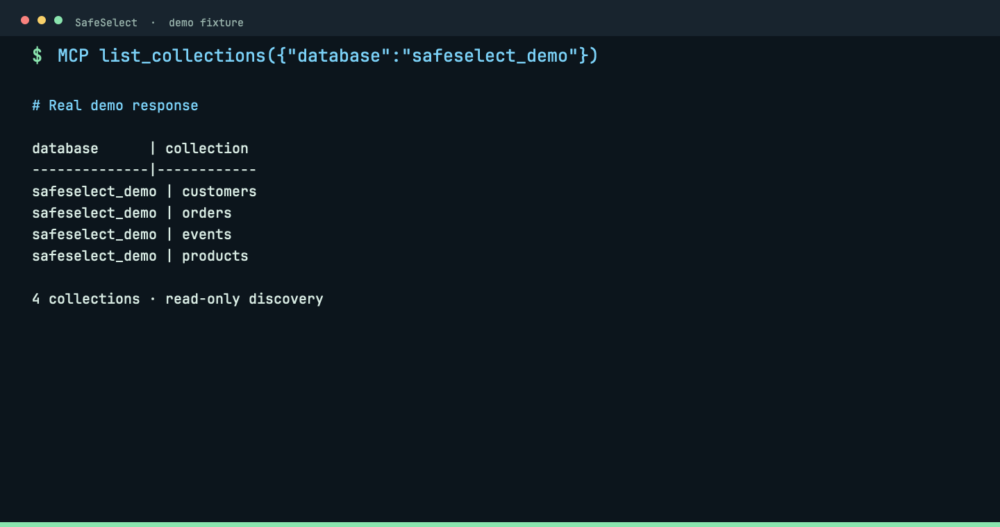</p>

_Real MCP response: four synthetic collections are listed without reading documents._

#### `discover_document_schema` (MCP)

Infer frequent fields and types from a bounded MongoDB sample.

```text
discover_document_schema({"database":"safeselect_demo","collection":"orders","sample_size":5})
```

<p>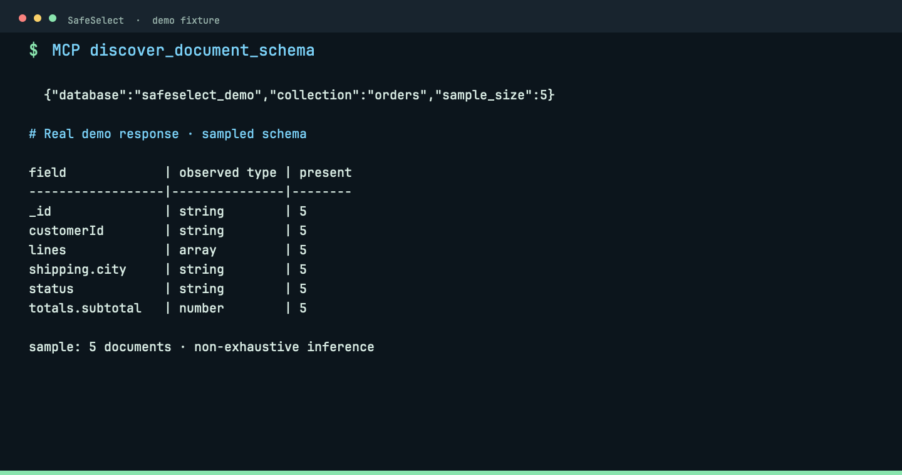</p>

_Real MCP response: sampled fields and observed types guide the next bounded read; inference is explicitly non-exhaustive._

#### `find_documents` (MCP)

Read bounded MongoDB documents with an explicit filter.

```text
find_documents({"database":"safeselect_demo","collection":"orders","filter":{"status":"paid"},"limit":3})
```

<p>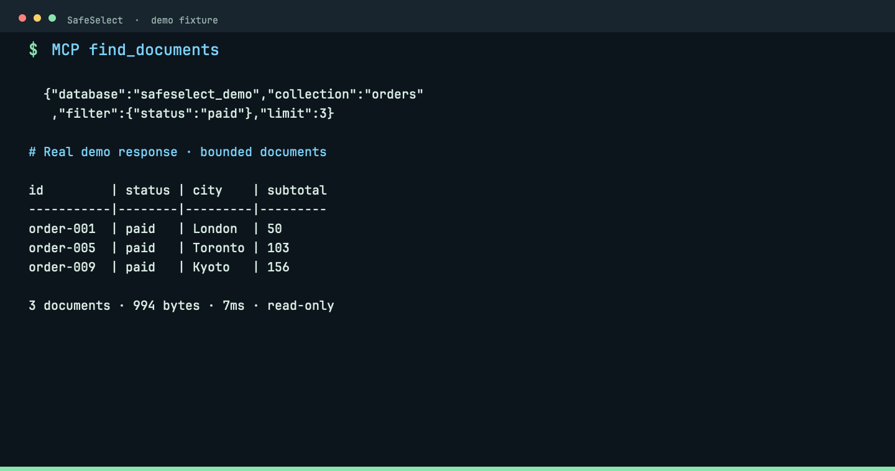</p>

_Real MCP response: three paid orders, 994 bytes, returned in 7ms. The filter and limit keep the read bounded._

</details>

Use `safeselect --help` or a command-specific `--help` for the full CLI.

Uninstall checks both release-installer and Cargo binary locations.
MongoDB Compass imports support SSH-tunneled `mongodb+srv://` connections by resolving
the SRV target and rewriting the local endpoint with the required TLS and direct-connection
options.

## Configuration

Global state lives in `~/.config/safeselect/` by default. Project policy lives in `.safeselect/` at the repository root:

```text
<repo-root>/
└── .safeselect/
    ├── project.toml
    └── environments/
        └── <env>.toml
```

SafeSelect walks upward from the current directory to find `.safeselect/`. Use `--project <path>` when an agent or script should target a specific repository.

### Convention before configuration

From inside a configured repository, commands infer the project from the nearest
`.safeselect/` directory and infer the environment when exactly one
`environments/*.toml` file exists. For example, `safeselect serve`,
`safeselect check`, `safeselect query --sql "SELECT 1"`, and
`safeselect config show` need no project or environment flags in a
single-environment project. `--project` and `--environment` remain available
for scripts, other working directories, and deliberate selection. If multiple
environments exist, commands that act on one fail rather than guess and tell
you to pass `--environment <name>`.

The defaults differ by operation:

- `serve`, `query`, `connect`, `disconnect`, `config show`, and password
  commands require one explicit or uniquely inferred environment. With no
  environments they fail; `serve` has the separate first-run behavior above.
- `check`, `doctor`, `posture`, `reconnect`, and `config validate` inspect or
  process all environments when the flag is omitted. Checks are not offline:
  they can resolve secrets, establish SSH tunnels, and contact databases. Use
  `--environment <name>` to avoid touching unrelated or production environments.
- `query` supports JDBC environments only and still needs SQL through `--sql`
  or stdin (interactive stdin waits for EOF). Selecting a MongoDB environment
  does not turn it into a MongoDB query command.
- CLI `connect` and `disconnect` operate on a new, temporary JDBC sidecar and
  shut it down before exiting. They do not control an already-running MCP
  session; use that session's MCP connection tools instead.
- Password commands modify local Keychain/configuration, not the database
  password itself. `config set-ssh-password` switches SSH authentication to
  password and clears the configured identity-file reference.

Generated MCP entries deliberately pin both project and environment. Keep those
arguments in client configuration and unattended scripts: inference is a CLI
convenience, not a persistent default environment.

## Supported Agents

| Client | User scope | Project scope | Integration |
|---|---:|---:|---|
| OpenCode | Yes | Yes | JSON/JSONC `mcp` |
| OpenAI Codex | Yes | Yes | lossless TOML `mcp_servers` |
| Claude Code | Yes | Yes | native `claude mcp` scopes |
| Cursor | Yes | Yes | `.cursor/mcp.json` |
| Windsurf | Yes | No | global Windsurf MCP config |
| GitHub Copilot | Yes | Yes | `servers` in MCP JSON |
| Gemini CLI | Yes | Yes | `.gemini/settings.json` |

SafeSelect never silently falls back to a broader scope. In particular,
`--local` for Windsurf fails with a clear correction because Windsurf does not
document a project-scoped MCP configuration.

## Build From Source

```bash
# Installs makevn through Homebrew or asdf only when it is missing.
./install.sh --install-makevn
"$HOME/.local/bin/safeselect" --version
```

Requirements: Rust 1.85+ and Java 17+. The bootstrap requires Homebrew or
asdf; otherwise install `makevn` first. `sshpass` is optional for
password-based SSH tunnels. Add `~/.local/bin` to your `PATH` before invoking
`safeselect` without its full path.

## Documentation

- [Installation guide](docs/install.md)
- [AI agent integration](docs/agents.md)
- [On-demand Codex code review](docs/code-review.md)
- [Security model](docs/security.md)
- [Security Proof](docs/security-proof.md)
- [Security test suite](docs/security-test-suite.md)
- [Security policy](SECURITY.md)
- [Distribution](docs/distribution.md)
- [Changelog](CHANGELOG.md)

Release notes are generated from `CHANGELOG.md`.

## Ecosystem

<details>
<summary>Directory listings</summary>

[](https://mcpservers.org/servers/antonillos/safeselect)
[](https://www.tensorblock.co/mcp/servers/github-antonillos-safeselect-4c99dff4)
[](https://lobehub.com/mcp/antonillos-safeselect)

</details>

<details>
<summary>Runtime and distribution</summary>

[]()
[]()
[]()
[]()
[](https://github.com/antonillos/homebrew-tap)
[](https://github.com/antonillos/asdf-safeselect)

</details>

## License

MIT - see [LICENSE](LICENSE).
