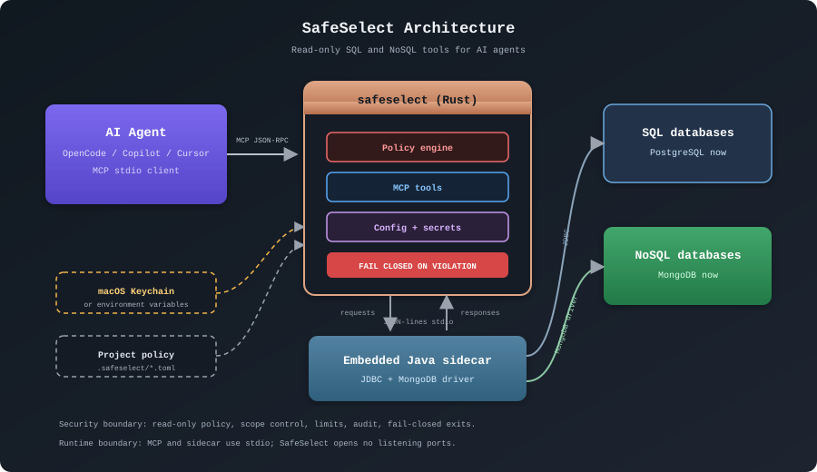
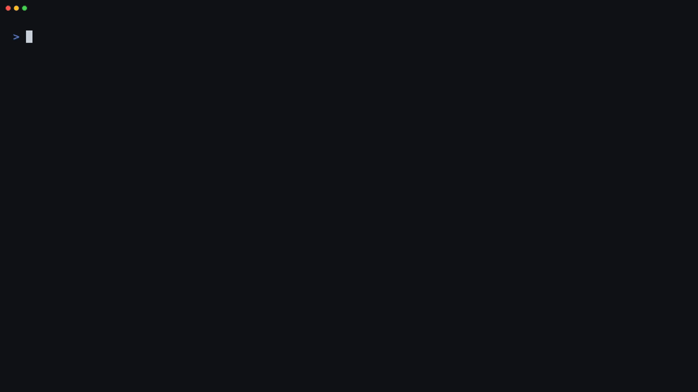

<p>
  <picture>
    <source media="(prefers-color-scheme: dark)" srcset="site/public/icon-dark.svg">
    
  </picture>
  &nbsp;<strong>SafeSelect</strong> <code>MCP</code>
</p>

<h1>Agents can look.<br>They cannot mutate.</h1>

**Read-only PostgreSQL & MongoDB access for coding agents.**

Debug with real database context, without exposing write tools—even when your
existing credentials allow writes. SafeSelect puts local, project-scoped policy
between your agent and your data.

[**Get started →**](#quick-start) ·
[Website](https://antonillos.github.io/safeselect/) ·
[Compare approaches](docs/compare.md) ·
[DBeaver → Codex guide](docs/guides/dbeaver-codex.md)

[](https://github.com/antonillos/safeselect/actions/workflows/verify.yml)
[](https://github.com/antonillos/safeselect/actions/workflows/verify.yml)
[](LICENSE)

[](https://mcpservers.org/servers/antonillos/safeselect)
[](https://www.tensorblock.co/mcp/servers/github-antonillos-safeselect-4c99dff4)
[](https://lobehub.com/mcp/antonillos-safeselect)

<details>
<summary>Runtime and distribution</summary>

[]()
[]()
[]()
[]()
[](https://github.com/antonillos/homebrew-tap)
[](https://github.com/antonillos/asdf-safeselect)

</details>

Discover structure, inspect bounded rows, explain queries, and diagnose
connectivity—without giving the agent write-capable tools or database credentials.
Start with development data or a sanitized replica, then review the policy and
effective database permissions before connecting to a more sensitive environment.

> [!NOTE]
> SafeSelect is a safety boundary for agent access, not a replacement for database permissions. Use least-privilege database users when you can; SafeSelect still constrains overpowered credentials when agents connect through it.

Current backend support: PostgreSQL and MongoDB.

## Where It Helps

- Debug an application against realistic data without exposing mutation tools.
- Let an agent inspect schemas, indexes, query plans, and bounded rows during development.
- Explore MongoDB collections through bounded reads and sampled schema inference.
- Reuse existing DBeaver, Docker Compose, or MongoDB Compass connections.
- Give coding agents database context while keeping policy, limits, secrets, and audit under your control.

## Why SafeSelect?

SafeSelect is intentionally narrower than general-purpose database MCP servers. It is not a tool builder, SQL workbench, or remote database gateway. It is a local safety boundary for agents that need database visibility, not database power.

| SafeSelect prioritizes | What this means |
|---|---|
| Local stdio transport | No network listener or open MCP port |
| Read-only tools | Agents do not receive write-capable database tools |
| Credential-independent safety | Even DBA credentials are constrained to SafeSelect's read-only tool surface |
| Fail-closed enforcement | Policy violations terminate the process |
| Secret isolation | Passwords stay in Keychain or environment variables |
| Project-scoped policy | Each repository defines its own allowed data surface |
| Embedded sidecar | One installed binary reaches JDBC and MongoDB drivers behind Rust policy |

## What Makes It Different?

The combination matters: PostgreSQL **and** MongoDB inspection, a fixed database
read surface, local stdio, project policy, connection import and reproducible
security evidence. Read-only modes and layered controls also exist in other
projects; they are not exclusive to SafeSelect.

See the [dated comparison](docs/compare.md) for DBHub, MongoDB MCP Server,
Postgres MCP Pro and SchemaBrain—including when each is a better fit.

**Agents can look, but they cannot mutate through SafeSelect's database tools.**
This boundary does not cover a shell, another MCP server or direct credentials
also available to the agent. Use least-privilege database users and review the
[threat model and limits](docs/security-proof.md).

## Backend Support

| Backend | Status | Tools |
|---|---|---|
| PostgreSQL | Supported | Discovery, indexes/statistics, `select`, and `explain` |
| MongoDB | Supported | Discovery, find, aggregation, distinct/count, explain, profiling, schema inference, and anonymized fixtures |

## Architecture

<p align="center">
  
</p>

The agent talks to SafeSelect through MCP stdio. SafeSelect enforces policy in Rust, stores secrets outside project files, and reaches databases through an embedded Java sidecar: JDBC for SQL backends and the MongoDB driver for MongoDB. The Rust to Java channel is JSON-lines over stdin/stdout: no sockets, no open ports.

## See it in action

### Complete onboarding: from Homebrew to a protected agent

<p align="center">
  
</p>

Install SafeSelect from Homebrew, import an SSH-backed DBeaver connection,
keep the password in macOS Keychain, install the OpenCode integration, and see
the agent read a paid order while its `DELETE` attempt is rejected. Focused
agent and backend clips remain in the [complete demo gallery](demo/README.md).

## Quick Start

Install SafeSelect with one of the following package managers:

### Homebrew (macOS)

```bash
brew install antonillos/tap/safeselect
```

### asdf (macOS & Linux)

```bash
asdf plugin add safeselect https://github.com/antonillos/asdf-safeselect.git
asdf install safeselect latest
asdf set -u safeselect latest
asdf reshim safeselect latest
```

After installing the binary, configure a project database and its MCP entry:

```bash
# Import a project database
safeselect import-dbeaver ~/Downloads/dbeaver-export.zip
# or:
# safeselect import-compose
# safeselect import-compass --path "$HOME/.config/MongoDB Compass"

# Verify the environment
safeselect check --environment testing

# Install the MCP entry. If this is the only environment, its name is inferred.
safeselect agent install opencode

# Verify exactly what was installed and where.
safeselect agent status
```

SafeSelect uses any available Java 17+ runtime rather than requiring a specific
package-manager formula. If Java is missing or too old, install or select a
Java 17+ runtime before running database commands. On macOS with Homebrew, you
can install one with `brew install openjdk@17`.

The generated MCP name defaults to `safeselect-<project>-<environment>`.

The generated MCP entry is a stdio server scoped to one project and environment:

```json
{
  "mcpServers": {
    "safeselect-myapp-testing": {
      "command": "safeselect",
      "args": ["serve", "--project", "/path/to/myapp", "--environment", "testing"]
    }
  }
}
```

SafeSelect uses each client's official MCP configuration contract, pins the
absolute repository path, and defaults to user scope. Add `--local` for a
project-scoped entry where the client supports it. See
[AI agent integration](docs/agents.md) for exact paths, scopes, and manual
configuration.

## Guided MCP Context

Clients that support MCP prompts can invoke `read_only_database_debugging` for a
safe investigation checklist. Clients can also read
`safeselect://guide/read-only-database-debugging` for the same static workflow
and boundary notes. Neither capability exposes database data, credentials, or
write access; use the database tools below for discovery and bounded reads.

## Agent Workflow

Agents should use SafeSelect in this order:

1. `database_info`
2. `list_tables` then `describe_table`; inspect `list_table_indexes` or bounded statistics when useful for SQL
3. `list_databases`, `list_collections`, then `discover_document_schema` for NoSQL
4. `select` / `explain`, or the bounded MongoDB read tool that matches the task
5. `check`, `connect`, or `reconnect` when connectivity is stale

Agents must discover relation or collection structure before querying unfamiliar data and use each discovery response's `next_suggestion` instead of guessing column or field names. SQL descriptions are catalog metadata; MongoDB schemas are inferred from a bounded, non-exhaustive sample.

MongoDB query documents must remain complete nested JSON values. Clients that
flatten nested tool arguments can pass `filter`, `projection`, and `sort` as
JSON-encoded object strings and `pipeline` as a JSON-encoded array string.
`redact_fields` also accepts a JSON-encoded string array. Flattened keys are
rejected so a lost filter or redaction can never become a less constrained
fallback.

MongoDB server-side JavaScript is never available: `$where`, `$function`, and
`$accumulator` are rejected recursively in filters, projections, sorts, and
aggregation pipelines before the MongoDB driver receives them. When rejected,
rebuild the request with declarative MQL operators; SafeSelect has no setting
that enables JavaScript.

Query responses include `row_count`, `byte_count`, `elapsed_ms`, and a human-readable `elapsed` value so agents can reason about result size and latency.

Every MCP success and error includes one contextual `next_suggestion`. Agents
should follow that single safe action, never blindly repeat an invalid request,
and stop when the suggestion is terminal. For clients that only show an MCP
error summary, SafeSelect also includes the trusted next suggestion in that
summary without exposing database-derived detail.

## Security Model

- **Fail closed**: security violations terminate the MCP process.
- **Read only**: SQL allows `SELECT`, `EXPLAIN`, and `WITH`; NoSQL backends allow discovery and read-only document reads.
- **No server-side JavaScript**: MongoDB `$where`, `$function`, and `$accumulator` are rejected in Rust and again in the Java sidecar.
- **Scoped access**: schemas, relations, databases, and collections can be allowed or denied.
- **Hard limits**: row count, result bytes, and timeouts are enforced; MongoDB read commands receive the same timeout as `maxTimeMS`.
- **Secret isolation**: passwords live in macOS Keychain or environment variables, never in project config.
- **Driver verification**: JDBC drivers are checked by SHA-256 before use.
- **Audit trail**: query text is hashed before being recorded; the current session exposes bounded audit metadata through `audit_status` and `audit_recent`.

### Deliberate Limits

- SafeSelect does not expose database writes, migrations, administration, or arbitrary command execution.
- PostgreSQL and MongoDB are the supported backends today; broad connector count is not the goal.
- MCP transport is local stdio. SafeSelect is not a remote database gateway.
- MongoDB schema discovery is sampled and bounded, not an exhaustive schema guarantee.
- SafeSelect complements database-native least privilege; it does not replace it.

## MCP Tools

| Area | Tools |
|---|---|
| SQL | `list_tables`, `describe_table`, `list_table_indexes`, `list_table_partitions`, `get_database_stats`, `get_table_stats`, `select`, `explain` |
| MongoDB reads | `list_databases`, `list_collections`, `find_documents`, `aggregate_documents`, `distinct_documents`, `count_documents`, `explain_documents` |
| MongoDB analysis | `profile_document_field`, `discover_document_schema`, `generate_document_fixture`, `list_collection_indexes`, `get_database_stats`, `get_collection_stats` |
| Connection | `database_info`, `check`, `connect`, `disconnect`, `reconnect` |
| Audit | `audit_status`, `audit_recent` |
| Config | `config_validate`, `config_show`, `config_set_password`, `config_rename_environment`, `config_delete_environment`, `config_reset` |
| Setup | `import_compose`, `driver_list`, `driver_add`, `driver_download`, `agent_detect`, `agent_install`, `agent_status`, `agent_uninstall` |

When no `.safeselect/` directory exists, `safeselect serve --environment <env>` enters setup mode automatically and exposes only the setup-safe tools.

> [!IMPORTANT]
> Setup mode does not expose query tools. Agents can help import and validate configuration before any database inspection tools become available.

## CLI Essentials

| Command | Purpose |
|---|---|
| `safeselect serve --environment <env>` | Start the MCP server |
| `safeselect check --environment <env>` | Verify config, secrets, tunnels, sidecar, and backend connectivity |
| `safeselect doctor --environment <env>` | Print deeper diagnostics with stable codes |
| `safeselect import-dbeaver <zip>` | Import DBeaver connections |
| `safeselect import-compose [--path <path>]` | Import from docker-compose |
| `safeselect import-compass [--path <path>]` | Import MongoDB Compass connections |
| `safeselect agent install <client> --environment <env>` | Install an MCP entry |
| `safeselect config set-password --environment <env>` | Store the database password |
| `safeselect config set-ssh-password --environment <env>` | Store the SSH password |
| `safeselect uninstall` | Remove installed binaries, global state, audit data, and Keychain entries |
| `safeselect uninstall --binary-only` | Remove only user-local binaries and preserve configuration |

Use `safeselect --help` or a command-specific `--help` for the full CLI.

Uninstall checks both release-installer and Cargo binary locations.
MongoDB Compass imports support SSH-tunneled `mongodb+srv://` connections by resolving
the SRV target and rewriting the local endpoint with the required TLS and direct-connection
options.

## Configuration

Global state lives in `~/.config/safeselect/` by default. Project policy lives in `.safeselect/` at the repository root:

```text
<repo-root>/
└── .safeselect/
    ├── project.toml
    └── environments/
        └── <env>.toml
```

SafeSelect walks upward from the current directory to find `.safeselect/`. Use `--project <path>` when an agent or script should target a specific repository.

## Supported Agents

| Client | User scope | Project scope | Integration |
|---|---:|---:|---|
| OpenCode | Yes | Yes | JSON/JSONC `mcp` |
| OpenAI Codex | Yes | Yes | lossless TOML `mcp_servers` |
| Claude Code | Yes | Yes | native `claude mcp` scopes |
| Cursor | Yes | Yes | `.cursor/mcp.json` |
| Windsurf | Yes | No | global Windsurf MCP config |
| GitHub Copilot | Yes | Yes | `servers` in MCP JSON |
| Gemini CLI | Yes | Yes | `.gemini/settings.json` |

SafeSelect never silently falls back to a broader scope. In particular,
`--local` for Windsurf fails with a clear correction because Windsurf does not
document a project-scoped MCP configuration.

## Build From Source

```bash
./install.sh
safeselect --version
```

Requirements: Rust 1.81+, Java 17+, and `makevn`. If makevn is missing, use
`./install.sh --install-makevn` to install it through Homebrew or asdf.
`sshpass` is optional for password-based SSH tunnels.

## Documentation

- [Installation guide](docs/install.md)
- [AI agent integration](docs/agents.md)
- [On-demand Codex code review](docs/code-review.md)
- [Security model](docs/security.md)
- [Security Proof](docs/security-proof.md)
- [Security test suite](docs/security-test-suite.md)
- [Security policy](SECURITY.md)
- [Distribution](docs/distribution.md)
- [Changelog](CHANGELOG.md)

Release notes are generated from `CHANGELOG.md`.

## License

MIT - see [LICENSE](LICENSE).
