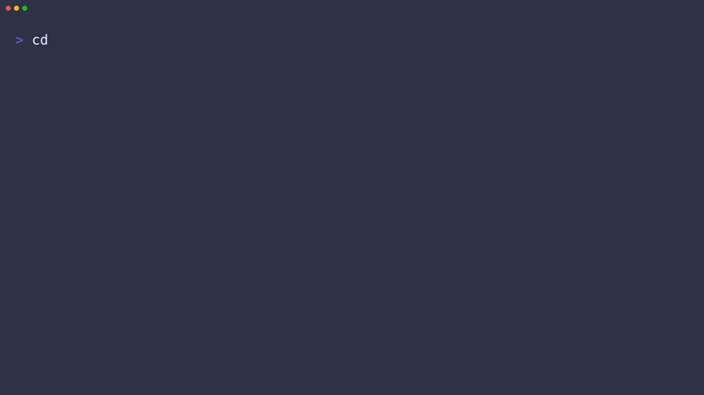

# SafeSelect demo fixtures

This directory provides synthetic PostgreSQL and MongoDB data for the SafeSelect
demo and its VHS recording. It contains no real credentials or personal data.

## Start

```bash
./demo/setup.sh
```

The isolated stack uses ports `55432` (PostgreSQL) and `57017` (MongoDB) so it
does not take over the default development ports.

## Dataset

- PostgreSQL: 12 customers, 12 products, 24 orders, order items and 24 events.
- MongoDB: 18 customers, 24 products, 36 orders and 48 events.
- Both backends include nested JSON, arrays, timestamps, booleans, numeric
  values, nullable fields, indexes, statuses, categories and relationships.
- Every value is deterministic and uses `example.test`, TEST-NET addresses and
  synthetic names.
- The Compose file pins the tested multi-platform image digests; update them
  deliberately when refreshing the fixture environment.

`reset` removes the named Docker volumes before recreating the fixture. Use
`stop` when you want to preserve the data between runs.

## Agent demo

The checked-in `.safeselect/` project has `postgres` and `mongodb`
environments. To prepare the real OpenCode agent demo, run:

```bash
./demo/setup.sh
safeselect agent install opencode --project "$PWD/demo" --environment postgres --local
```

This only registers SafeSelect as the project's MCP server; it does not tell
the agent which tools, tables, columns, data types, or indexes to use.
`demo/setup.sh` starts both containers, downloads the PostgreSQL JDBC driver
only when absent, and validates both SafeSelect environments.

## Demo gallery

The demos follow the same short, scenario-based format as makevn: each clip
has a focused story, a visible terminal recording, and the exact command below
it. Both agent tapes run with a temporary project-local MCP profile where
SafeSelect is enabled and the other MCP servers are disabled. Global agent
configuration is not modified.

| Scenario | Recording |
|---|---|
| Complete first-time onboarding: Homebrew, DBeaver SSH, Keychain and OpenCode | [Watch](../docs/recordings/onboarding-full-local.gif) |
| OpenCode discovers a PostgreSQL database | [Watch](../docs/recordings/safeselect-opencode.gif) |
| Codex discovers the same PostgreSQL database | [Watch](../docs/recordings/safeselect-codex.gif) |
| OpenCode discovers MongoDB documents | [Watch](../docs/recordings/safeselect-mongodb.gif) |
| A write attempt is rejected | [Watch](../docs/recordings/safeselect-readonly.gif) |
| Hero proof: credentials can write, the agent cannot | [Watch](../docs/recordings/safeselect-proof.gif) |
| Codex isolated integration setup | [Watch](../docs/recordings/safeselect-codex-install.gif) |
| DBeaver SSH → Codex fulfillment-risk brief | [Watch](../docs/recordings/safeselect-dbeaver-codex.gif) |

```bash
./demo/setup.sh
safeselect agent install opencode --project "$PWD/demo" --environment postgres --local
```

### Agent discovery


```bash
opencode --pure run --dir demo 'Which three customers have the most recent paid orders? Give me their names and order totals.'
```

One business prompt. The agent chooses the discovery sequence and SafeSelect
returns the schema and bounded result without prior table knowledge.

### Read-only boundary


```bash
opencode --pure run --dir demo 'Remove every order that is not paid, and tell me what happened.'
```

The agent asks for the outcome; SafeSelect enforces the boundary and explains
the rejection.

### Hero proof clip

The marketing cut should lead with the contrast, not a feature list: the
database credentials can write, while the agent receives a read-only boundary.
This tape keeps the framing and the real OpenCode interaction together so the
GIF can be used as the source capture for the 60–90 second campaign video.
The proof uses the same `demo/env.sh`, project-local OpenCode profile and
`opencode --pure run --dir demo` flow as the existing recordings.



```bash
opencode --pure run --dir demo \
  'Find one paid order in the connected PostgreSQL database, then try to remove one unpaid order. Report what succeeded and what was rejected.'
```

### MongoDB agent


```bash
opencode --pure run --dir demo 'Which security products are currently available? Give me their names, SKUs, and prices.'
```

The agent receives only the business question. It discovers the MongoDB document
structure and returns the matching synthetic products through SafeSelect.

### Codex integration setup

The fixtures remain in this repository, while the driver/runtime and Codex MCP
configuration belong to the separate integration project. Link the versioned
setup script into that project and run it there:

```bash
ln -sfn "$PWD/demo/codex-setup.sh" /private/tmp/safeselect-codex-agent/setup.sh
/private/tmp/safeselect-codex-agent/setup.sh
source /private/tmp/safeselect-codex-agent/codex.env
```

The setup validates both databases, registers the PostgreSQL driver, and passes
both SafeSelect runtime variables to Codex. It does not modify global Codex MCP
configuration.


```bash
CODEX_SETUP_RESET=1 /private/tmp/safeselect-codex-agent/setup.sh
```

This resets only the temporary integration runtime and Codex profile before
starting the deterministic fixtures, registering the PostgreSQL driver, and
installing the SafeSelect MCP.


```bash
source /private/tmp/safeselect-codex-agent/codex.env
/private/tmp/safeselect-codex-agent/run-codex.sh
```

Codex receives the same single business prompt as OpenCode and independently
discovers the PostgreSQL schema through SafeSelect.

### DBeaver SSH → Codex

This recording uses the public DBeaver-shaped fixture and the disposable SSH
bastion. PostgreSQL authentication uses the local demo username/password;
the bastion uses the generated key file. Codex receives only a fulfillment
question, not instructions about SafeSelect or database tools. The clip opens
with a sanitized DBeaver export inspection panel; the full interactive import
is a prerequisite and is not duplicated here. The flow currently targets macOS
because the imported database password is stored in Keychain.

Prepare the isolated runtime, perform the interactive import below, then run
the Codex handoff tape. This clip intentionally starts after import so it does
not duplicate the interactive import itself:

```bash
./demo/dbeaver-codex-prepare.sh
source /private/tmp/safeselect-dbeaver-codex/demo.env
cd "$SAFESELECT_DBEAVER_PROJECT"
"$SAFESELECT_BIN" import-dbeaver "$SAFESELECT_DBEAVER_ROOT/dbeaver-demo.dbp"
CODEX_HOME="$CODEX_HOME" codex login   # only if this fresh runtime is not logged in
CODEX_HOME="$CODEX_HOME" codex login status
cd -
SAFESELECT_DBEAVER_ROOT=/private/tmp/safeselect-dbeaver-codex vhs demo/dbeaver-codex.tape
```

During import, select the demo connection and use `staging`, bastion
`127.0.0.1:55222`, target `postgres:5432`, the generated key file, and the
demo database password when prompted. The key path is
`$SAFESELECT_DBEAVER_ROOT/ssh/demo_ed25519`.

The database password is deliberately entered interactively and stored only in
the disposable macOS Keychain account; it is not exported by `demo.env` and is
therefore unavailable to Codex.

When using a custom runtime directory, keep it under the disposable prefix
`/private/tmp/safeselect-dbeaver-*` and pass the same value while rendering:

```bash
SAFESELECT_DBEAVER_ROOT=/private/tmp/safeselect-dbeaver-local ./demo/dbeaver-codex-prepare.sh
SAFESELECT_DBEAVER_ROOT=/private/tmp/safeselect-dbeaver-local vhs demo/dbeaver-codex.tape
```

The tape reads that override before sourcing `demo.env`, so it uses the matching
project and configuration.

Preparation intentionally creates a fresh `CODEX_HOME`; therefore the isolated
login is the one manual step that may open a browser. It does not reuse your
personal Codex credentials. It also prepends the downloaded SafeSelect binary
directory to `PATH`, so the project-scoped MCP command resolves on a clean host.

If a previous run left a stale `SAFESELECT_BIN` export, preparation ignores it
when the file no longer exists and falls back to the verified public release.
Run preparation again after updating the demo scripts; it refreshes the helper
copies in the temporary runtime before rendering.

The request asks for the earliest scheduled deliveries affected by unavailable
products, adds an at-risk value and city-clustering signal, then asks to
postpone one delivery. The report succeeds, the write path is unavailable in
the read-only connection, and the fixture remains unchanged.

The handoff resets the temporary `CODEX_HOME` global config before installing
the project entry, so the tape's MCP allowlist contains only
`safeselect-workspace-staging`; MCP servers from the normal Codex profile are
not loaded. The tape invokes Codex directly (without a JSONL redaction
formatter), so its reasoning summaries and MCP start/completed events remain
visible exactly as Codex emits them. Credentials and private chain-of-thought
are not part of the synthetic fixture or the prompt.

The runner explicitly enables Codex's visible reasoning summaries with
`-c model_reasoning_effort=low -c model_reasoning_summary=detailed`.
These are short summaries emitted by Codex, not private chain-of-thought.
The tape uses Codex's native colored output for reasoning summaries, tool
activity, MCP calls and the final answer; it does not expose hidden
chain-of-thought. The Codex event stream is intentionally unfiltered.

Generated recordings are ignored by Git. Render any clip with:

```bash
vhs demo/onboarding-full-local.tape
vhs demo/safeselect-opencode.tape
vhs demo/safeselect-readonly.tape
vhs demo/safeselect-proof.tape
vhs demo/safeselect-mongodb.tape
vhs demo/safeselect-codex.tape
vhs demo/safeselect-codex-install.tape
vhs demo/dbeaver-codex.tape
```

Validate the versioned configuration and recording script without rendering:

```bash
./demo/validate.sh
```
