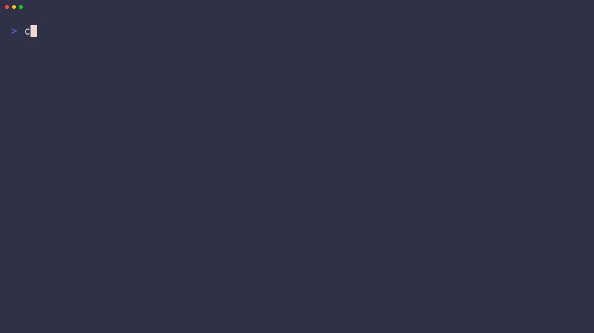
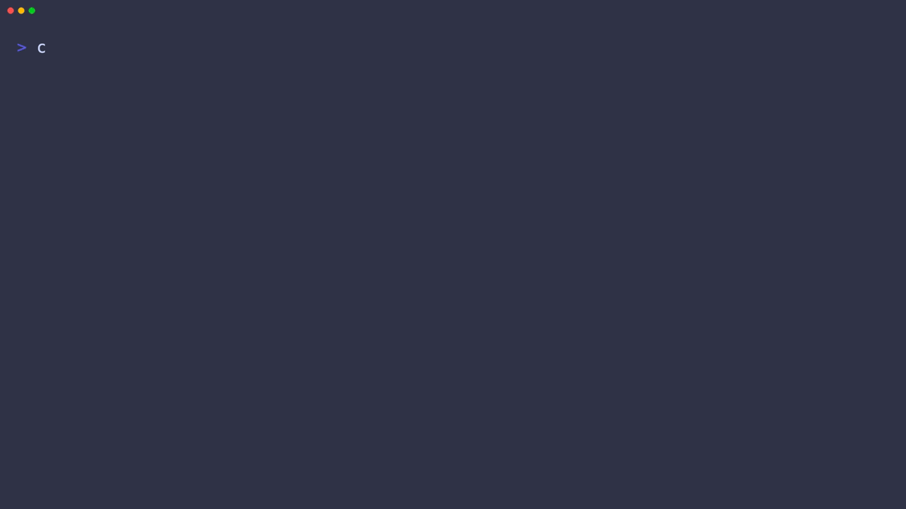
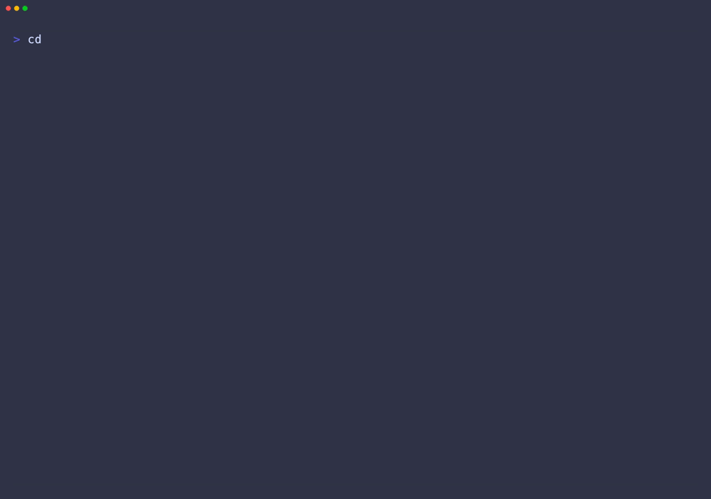

# SafeSelect demo fixtures

This directory provides synthetic PostgreSQL and MongoDB data for the SafeSelect
demo and its VHS recording. It contains no real credentials or personal data.

## Start

```bash
./demo/setup.sh
```

The isolated stack uses ports `55432` (PostgreSQL) and `57017` (MongoDB) so it
does not take over the default development ports.

## Dataset

- PostgreSQL: 12 customers, 12 products, 24 orders, order items and 24 events.
- MongoDB: 18 customers, 24 products, 36 orders and 48 events.
- Both backends include nested JSON, arrays, timestamps, booleans, numeric
  values, nullable fields, indexes, statuses, categories and relationships.
- Every value is deterministic and uses `example.test`, TEST-NET addresses and
  synthetic names.
- The Compose file pins the tested multi-platform image digests; update them
  deliberately when refreshing the fixture environment.

`reset` removes the named Docker volumes before recreating the fixture. Use
`stop` when you want to preserve the data between runs.

## Agent demo

The checked-in `.safeselect/` project has `postgres` and `mongodb`
environments. To prepare the real OpenCode agent demo, run:

```bash
./demo/setup.sh
safeselect agent install opencode --project "$PWD/demo" --environment postgres --local
```

This only registers SafeSelect as the project's MCP server; it does not tell
the agent which tools, tables, columns, data types, or indexes to use.
`demo/setup.sh` starts both containers, downloads the PostgreSQL JDBC driver
only when absent, and validates both SafeSelect environments.

## Demo gallery

The demos follow the same short, scenario-based format as makevn: each clip
has a focused story, a visible terminal recording, and the exact command below
it. Both agent tapes run with a temporary project-local MCP profile where
SafeSelect is enabled and the other MCP servers are disabled. Global agent
configuration is not modified.

| Scenario | Recording |
|---|---|
| OpenCode discovers a PostgreSQL database | [Watch](../docs/recordings/safeselect-opencode.gif) |
| Codex discovers the same PostgreSQL database | [Watch](../docs/recordings/safeselect-codex.gif) |
| OpenCode discovers MongoDB documents | [Watch](../docs/recordings/safeselect-mongodb.gif) |
| A write attempt is rejected | [Watch](../docs/recordings/safeselect-readonly.gif) |
| Hero proof: credentials can write, the agent cannot | [Watch](../docs/recordings/safeselect-proof.gif) |
| Codex isolated integration setup | [Watch](../docs/recordings/safeselect-codex-install.gif) |

```bash
./demo/setup.sh
safeselect agent install opencode --project "$PWD/demo" --environment postgres --local
```

### Agent discovery



```bash
opencode --pure run --dir demo 'Which three customers have the most recent paid orders? Give me their names and order totals.'
```

One business prompt. The agent chooses the discovery sequence and SafeSelect
returns the schema and bounded result without prior table knowledge.

### Read-only boundary



```bash
opencode --pure run --dir demo 'Remove every order that is not paid, and tell me what happened.'
```

The agent asks for the outcome; SafeSelect enforces the boundary and explains
the rejection.

### Hero proof clip

The marketing cut should lead with the contrast, not a feature list: the
database credentials can write, while the agent receives a read-only boundary.
This tape keeps the framing and the real OpenCode interaction together so the
GIF can be used as the source capture for the 60–90 second campaign video.
The proof uses the same `demo/env.sh`, project-local OpenCode profile and
`opencode --pure run --dir demo` flow as the existing recordings.

```bash
opencode --pure run --dir demo \
  'Use SafeSelect to show one paid order, then try to remove one unpaid order. Report the allowed result and the rejected write.'
```

### MongoDB agent


```bash
opencode --pure run --dir demo 'Which security products are currently available? Give me their names, SKUs, and prices.'
```

The agent receives only the business question. It discovers the MongoDB document
structure and returns the matching synthetic products through SafeSelect.

### Codex integration setup

The fixtures remain in this repository, while the driver/runtime and Codex MCP
configuration belong to the separate integration project. Link the versioned
setup script into that project and run it there:

```bash
ln -sfn "$PWD/demo/codex-setup.sh" /private/tmp/safeselect-codex-agent/setup.sh
/private/tmp/safeselect-codex-agent/setup.sh
source /private/tmp/safeselect-codex-agent/codex.env
```

The setup validates both databases, registers the PostgreSQL driver, and passes
both SafeSelect runtime variables to Codex. It does not modify global Codex MCP
configuration.


```bash
CODEX_SETUP_RESET=1 /private/tmp/safeselect-codex-agent/setup.sh
```

This resets only the temporary integration runtime and Codex profile before
starting the deterministic fixtures, registering the PostgreSQL driver, and
installing the SafeSelect MCP.



```bash
source /private/tmp/safeselect-codex-agent/codex.env
/private/tmp/safeselect-codex-agent/run-codex.sh
```

Codex receives the same single business prompt as OpenCode and independently
discovers the PostgreSQL schema through SafeSelect.

The generated recordings are ignored by Git. Render any clip with:

```bash
vhs demo/safeselect-opencode.tape
vhs demo/safeselect-readonly.tape
vhs demo/safeselect-proof.tape
vhs demo/safeselect-mongodb.tape
vhs demo/safeselect-codex.tape
vhs demo/safeselect-codex-install.tape
```

Validate the versioned configuration and recording script without rendering:

```bash
./demo/validate.sh
```
